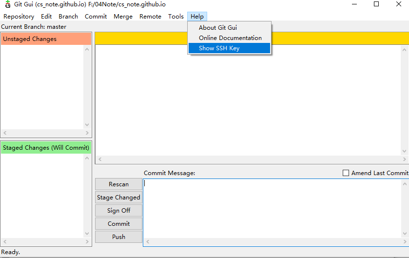
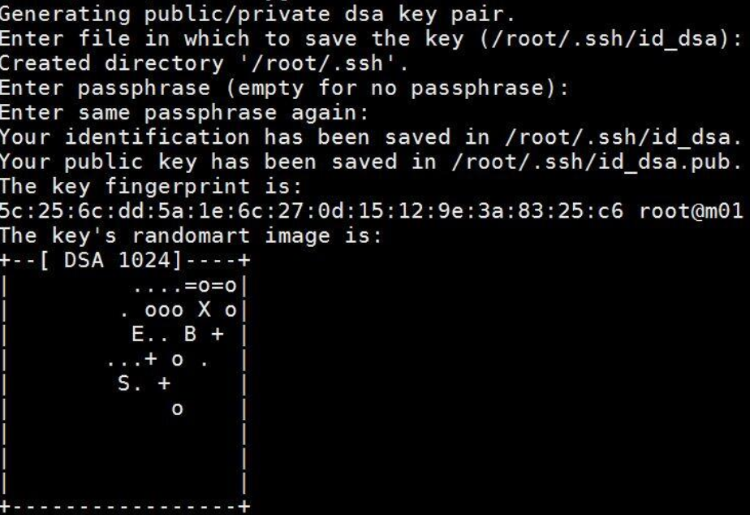

# Git

## 一、本机配置

1. 添加用户

    ``` 
    git config –global user.name “xx” 
    git config –gloaba user.email “xx@xx”
    ```

2. 查看git配置及用户信息 
    ```
    git config –list
    ```

3. 生成SSH秘钥
   
   - Git GUI图形界面化操作
   
     
   
   - Git Bash
   
   ```
    # 查看是否有秘钥，有则备份然后删除文件夹
    cd ~/.ssh 
    ls
    
    # 生成，enter确认
 ssh-keygen -t rsa -C “[email]xx@xx” 
    # Enter passphrase (empty for no passphrase):<输入你设置的密码>
    # Enter same passphrase again:<输入你设置的密码>
   ```
   
   
4. 配置Github

    - 文件夹.ssh（windows在C:\Users\xx\.ssh）--->公钥 id_rsa.pub，copy to Github->Settings->SSH keys（可以添加多个ssh key公钥）

    - 添加私钥到ssh：(optional)

      ```
       ssh -add id_rsa
      ```

5. 测试本机是否有访问Github的权限 ，输入密码确认

    ```
    ssh -T git@github.com
    ```


## 二、连接Github-Repisitory

1. local  to remote: 
   
   ```
   # 初始化
   git init
   # 添加remote仓库
   git remote add origin git@xxx
   git add ReadMe.md
   git status
   git commit -m "first commit"
   # 推送到remote
   git push -u origin master
   git status
   # commit changes
   git commit -a 
   # 修改之前提交过的文件再比较
   git diff xx
   # 解决冲突之后提交
   ```
   
2. Github已经创建好Repo

   ```
   git clone git@github.com:xx/xx.git
   ```


## 三、基本操作 

1. 目录&文件操作
    ```
    # Linux shell cmd
    cd d: 
    cd dir 
    mkdir FirstProgram 
    cd FirstProgram 
    pwd
    # 查看内容 
    cat readme.txt 
    # 删除文件 
    rm b.txt 
    # else
    ```
2. 常用操作
    ```
    # 添加到暂存区
    git add readme.txt
    # 未提交时 出现红色提醒
    git status
    git commit -m ‘提交时的注释 描述’ 
    git status(提交后 出现绿色提醒) 
    # 自动更新变化的文件
    git commit -a
    # 修改前后的对比查看
    git diff readme.txt
    ```
3. log
    ```
    # 查看提交历史,倒序记录: 信息包括提交版本号,作者,时间,提交内容
    git log
    # 简要查看历史,每次修改显示在一行
    git log –pretty=oneline
    ```
4. 版本回退
    ```
    # 把当前的版本回退到上1个版本
    git reset –hard HEAD^
    # 回退到上上1个版本
    git reset –hard HEAD^^
    # (把当前的版本回退到上100个版本) 
    git reset –hard HEAD~100
    # 撤销修改但还没添加到缓存区stage的内容
    git checkout –readme.txt
    git reflog 
    # 回退到制定版本
    git reset -hard [版本号]
    ```
5. 远端仓库管理
    ```
    # 删除远程端仓库xxx, 比如origin是远程仓库<即URL地址>别名) 
    git remote remove xxx
    # 添加remote仓库
    git remote add origin git@xxx
    # 重命名远端仓库
    git remote rename github newgit
    ```
6. Branch分支创建
    ```
    # 显示当前分支
    git branch
    # 显示所有分支
    git branch -a
    # 创建分支
    git branch xx-branch
    # 切换到新分支，从一个分支切换另一个分支需要先pull
    git checkout xx-branch

    # 从已有的分支创建新的分支(如从master分支),创建一个dev(develop简写)分支(相当于复制分支) 
    git checkout -b dev 

    # 把分支push到远端分支–>可以看到远端分支是push时产生的 
    git add page_cache.inc.php 
    git commit -a -m “added initial version of page cache” 
    # 分支提交到远程服务器，只是把分支结构和内容提交到远程，并没有发生和主干的合并行为
    git push origin xx-branch

    # 另一种push分支;如果是在当前loc-dev分支下,则可以只写git push 
    git push origin loc-dev:remote-branch-dev 

    # 分支拉取 
    git pull origin dev
    /*
    或者： 
    运行git fetch(前提是已经关联了本地与远端),可以将远程分支信息获取到本地， 
    再运行git checkout -b loc-v2 origin/remote-branch-v2就可以将远程分支映射到本地命名为loc-v2的一分支 
    */
    ```
7. master-branch管理
    ```
    # 本地分支合并,把分支合并到主干
    git checkout master
    git merge xx-branch

    # 远程分支合并(多一个远端地址和一个反斜杠/) 
    git merge origin/b 
    git branch # 显示当前分支是master
    git push # 此时主干中也合并了xx-branch的代码

    # 冲突解决：暂存本地内容，再pull
    git stash
    git pull 
    git stash pop stash@{0}  # stash@{0}修改标记，还原暂存的内容
    ```
8. 删除分支
    ```
    # 删除分支(前提是被删除的分支不是当前所在分支,否则删除不了) 
    git pull origin –delete dev 
    # 另一种删除分支 
    git push origin :dev 
    ```
9. 消除master分支的追踪 
    ```
    # 设置指定分支 
    git branch –set-upstream-to=origin/dev 
    # 取消对master的跟踪 
    git branch –unset-upstream master
    ```


## 三、概念分析

- 工作区: 一般就是工程区或者模块区 
- 隐藏文件夹.[Git](http://lib.csdn.net/base/git)不属于工作区 
- 版本库: 就是.[git](http://lib.csdn.net/base/git)目录.版本库里面存了很多东西，其中最重要的就是stage(暂存区)，还有Git为我们自动创建了第一 个分支master,以及指向master的一个指针HEAD。


## 四、总结


## 参考

[Git 总结](http://www.cnblogs.com/1-2-3/archive/2010/07/18/git-commands.html)